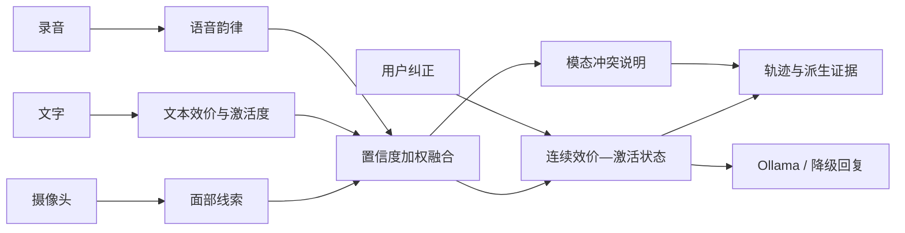

<div align="center">

# EmotiWeave · 情绪织谱

### 把分散的多模态线索，织成可解释、可纠正的情绪状态

[](https://github.com/tail258/emotiweave/releases/latest)
[](https://www.python.org/)
[](#开发与验证)
[](LICENSE)

**摄像头面部线索 · 中文文本 · 语音韵律 · 置信度融合 · 冲突解释 · 用户纠正**

[快速开始](#快速开始) · [核心能力](#核心能力) · [工作方式](#工作方式) · [评估](#评估与边界) · [运行文档](docs/RUNNING.md)

</div>

---

## 项目是什么

EmotiWeave 是我用来探索多模态情绪识别的一套本地应用。它不会把一个表情、一句话或一段
声音直接等同于人的真实情绪，而是把其中能够观察到的线索组合起来，给出连续的
**效价（Valence）—激活度（Arousal）**、置信度和模态冲突说明。

这个项目最早来自一个桌面虚拟助手原型。随着实现推进，我逐渐把重点收拢到几个更具体的
问题：不同模态是否一致，证据在什么时候失效，置信度从哪里来，以及系统不确定时应该怎样
表达。EmotiWeave 现在保留的就是这套可以在本地运行、测试和继续改进的实现。

> [!IMPORTANT]
> EmotiWeave 估计的是当前可观察线索，不是人的真实内心状态。使用者的自述和纠正始终比
> 系统估计更可靠。

## 核心能力

<table>
  <tr>
    <td width="33%" valign="top">
      <h3>◉ 多模态观察</h3>
      <p>分别处理摄像头面部线索、中文文本和语音韵律，保留每个模态自己的证据与置信度。</p>
    </td>
    <td width="33%" valign="top">
      <h3>⌁ 连续状态</h3>
      <p>用个人基线、时间平滑和过期控制生成连续的效价—激活度，而不是只输出一个固定标签。</p>
    </td>
    <td width="33%" valign="top">
      <h3>△ 冲突解释</h3>
      <p>当表情、文字和韵律给出相反线索时，记录冲突来源并降低总体置信度。</p>
    </td>
  </tr>
  <tr>
    <td width="33%" valign="top">
      <h3>↺ 用户纠正</h3>
      <p>支持标记判断是否准确，也可以让系统暂时停止判断；纠正只影响当前会话。</p>
    </td>
    <td width="33%" valign="top">
      <h3>◇ 可解释证据</h3>
      <p>展示实际参与融合的文本命中词、声学统计、面部线索、状态轨迹和置信度。</p>
    </td>
    <td width="33%" valign="top">
      <h3>⌂ 本地优先</h3>
      <p>默认不保存摄像头帧、原始录音或对话原文；Ollama 不可用时核心识别仍可运行。</p>
    </td>
  </tr>
</table>

## 工作方式



| 输入 | 处理方式 | 参与判断 |
| --- | --- | --- |
| 摄像头 | MediaPipe Face Landmarker、个人基线、时间平滑、线索过期 | 效价与激活度 |
| 中文文本 | 可解释词汇与规则线索 | 效价与激活度 |
| WAV 录音 | 能量、动态范围、音高变化、语速、停顿比、有声占比 | 仅激活度 |
| 用户纠正 | 会话内状态修正或暂时抑制判断 | 当前状态与后续交互 |

## 快速开始

### 环境要求

- Windows 10 或 Windows 11
- Python 3.11 或 3.12
- 摄像头；麦克风可选
- Ollama 可选，仅用于本地对话回复

### 安装

```powershell
git clone https://github.com/tail258/emotiweave.git
Set-Location emotiweave

py -3.11 -m venv .venv
Set-ExecutionPolicy -Scope Process Bypass
.\.venv\Scripts\Activate.ps1

python -m pip install --upgrade pip
python -m pip install -e .
python scripts\download_models.py
python main.py --check
```

### 启动

```powershell
.\start.ps1
```

预检通过后，应用会打开 [http://127.0.0.1:7860/](http://127.0.0.1:7860/)。也可以直接运行：

```powershell
python main.py
```

> [!TIP]
> 完整的安装、参数说明和常见问题见 [docs/RUNNING.md](docs/RUNNING.md)。

<details>
<summary><strong>可选：启用 Ollama 本地对话</strong></summary>

```powershell
ollama serve
ollama pull qwen2.5:3b
python main.py
```

Ollama 只负责生成回复，不影响情绪识别核心。模型、服务地址、超时、流式输出和驻留时间
位于 `config.yaml` 的 `brain` 节。服务不可用时，应用会使用确定性降级回复。

</details>

## 使用流程

1. 允许浏览器访问摄像头，保持自然表情片刻，让系统建立会话内基线。
2. 改变表情、输入文字或提交录音，观察各模态怎样改变当前状态。
3. 展开派生证据，检查真正参与融合的线索、置信度和冲突来源。
4. 使用纠正按钮标记结果，或者让系统暂时不要判断。
5. 需要重新开始时清空当前会话。

## 评估与边界

仓库带有一组确定性的冲突场景，用来检查融合、冲突检测和报告流程。它们是工程回归样本，
不是受试者数据，也不能用来宣称真实人群上的识别准确率。

<details>
<summary><strong>运行脚本回归与报告</strong></summary>

```powershell
python scripts\replay_scenarios.py `
  --dataset evaluation\datasets\scripted_conflicts.jsonl `
  --config config.yaml `
  --split scripted `
  --output reports\evaluation\runs\scripted\predictions.jsonl

python scripts\evaluate_sessions.py `
  --predictions reports\evaluation\runs\scripted\predictions.jsonl `
  --output reports\evaluation\runs\scripted-report
```

`reports/evaluation/scripted-final/` 保存了一次参考输出。真人样本的知情同意、匿名分组和
dev/test 隔离方法见 [evaluation/README.md](evaluation/README.md)。仓库不附带任何真人样本
或原始媒体。

</details>

> [!CAUTION]
> 本项目不用于心理诊断、医疗建议、招聘筛选、课堂监控或其他人员评估。表情和韵律会受到
> 个体、文化、光照、角度、设备与环境噪声影响；情绪识别只能作为可纠正的交互线索。

## 技术结构

```text
src/sentientbot/
├── affect/       # 校准、时序跟踪、融合与响应策略
├── dialogue/     # Ollama 和本机语音播报
├── evaluation/   # 数据校验、回放、指标、搜索与报告
├── perception/   # 面部、文本、ASR 与语音韵律分析
├── storage/      # 隐私约束下的派生事件日志
├── ui/           # Gradio 界面
├── app.py        # 应用编排与降级处理
├── config.py     # 配置模型
├── models.py     # 领域数据结构
└── session.py    # 会话状态
```

内部包名 `sentientbot` 沿用了早期原型，项目和发行名称统一为 EmotiWeave。更详细的模块关系
见 [docs/ARCHITECTURE.md](docs/ARCHITECTURE.md)。

## 开发与验证

```powershell
python -m pip install -e ".[dev]"
python -m pytest -q
python -m ruff check src scripts tests main.py
python main.py --check
```

单元测试与脚本回归不需要摄像头、麦克风、Ollama 或 Whisper 模型。

## 当前限制

- 文本分析采用可解释规则，不等同于完整的语义理解。
- 当前应用按本机单用户场景设计，没有公网服务所需的认证和会话隔离。
- 语音韵律只估计激活度，不直接推断积极或消极效价。
- 真人评估数据需要在取得知情同意后另行采集，仓库只提供数据结构和评估工具。

## 许可证

EmotiWeave 采用 [GNU Affero General Public License v3.0 only](LICENSE)，SPDX 标识为
`AGPL-3.0-only`。通过网络提供修改版服务时，也需要按照许可证提供对应源代码。

<div align="center">

**EmotiWeave · Observe uncertainty, keep correction in the loop.**

</div>
