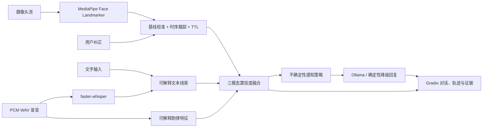

# EmotiWeave｜情绪织谱架构说明

## 定位

EmotiWeave 是一个可纠正、感知不确定性的本地三模态交互工具。系统估计当前可观察线索，不推断用户的真实内心状态。

当前实现采用单机模块化单体架构。摄像头流、语音分析、状态融合、对话和界面运行在同一进程中，适合本机单用户场景。

## 运行架构



## 领域数据

- `VisualEvidence`：单次视觉观察及可解释面部线索。
- `TextEvidence`：文本效价、激活度、置信度和命中词。
- `AudioEvidence`：语音持续时间、激活度、置信度和可解释声学特征。
- `AffectState`：融合后的连续状态、稳定性、数据源和冲突原因。
- `ResponsePlan`：确定性策略层生成的回复约束。
- `UserCorrection`：用户对当前估计的会话内修正。

适配器不直接决定回复策略。领域决策统一经过：

```text
AffectTracker → AffectFusion → InteractionPolicy
```

核心状态机因此可以脱离摄像头、麦克风和语言模型独立测试。

## 语音韵律

`AudioCueAnalyzer` 处理 PCM WAV，并计算：

- 40 ms 分帧、20 ms 步长的 RMS 能量；
- 动态范围与帧间能量变化；
- 70–350 Hz 自相关基频及相对变化；
- 基于转写字符数的说话速率；
- 有声占比和停顿比。

语音韵律只映射到激活度。有效时长或有声比例不足时，证据置信度归零。

## 时间与融合

- 视觉状态使用单调时钟；平滑系数根据实际帧间隔计算。
- 人脸消失后置信度衰减，超过 `stale_after_seconds` 后进入 `unknown`。
- 当前轮次的文本和音频派生证据保留 8 秒。
- 效价由视觉与文本加权，语音不稀释明确的文本效价。
- 激活度由视觉、文本和语音共同加权。
- 可靠模态方向相反且距离超过阈值时，记录冲突原因并降低置信度。
- 用户可纠正当前状态；“暂不判断”会抑制估计 10 秒。

## 隐私

默认日志只记录派生状态、响应策略和耗时：

- 不保存摄像头帧或录音；
- `store_transcripts: false` 时不记录对话文本；
- 语音日志只包含派生统计量。

## 降级

- Face Landmarker 不可用时关闭视觉分析。
- faster-whisper 不可用时保留文字输入和韵律分析。
- Ollama 不可用时使用确定性回复。
- 语音播报失败时保留文字回复。

任何单个适配器失败都不应中断界面和领域状态机。

## 部署边界

当前服务默认监听 `127.0.0.1`，没有身份认证和多用户会话隔离。部署到局域网或公网前需要补充：

- 身份认证与访问控制；
- 独立会话存储；
- TLS；
- 日志保留与删除策略；
- 并发与资源限制。
